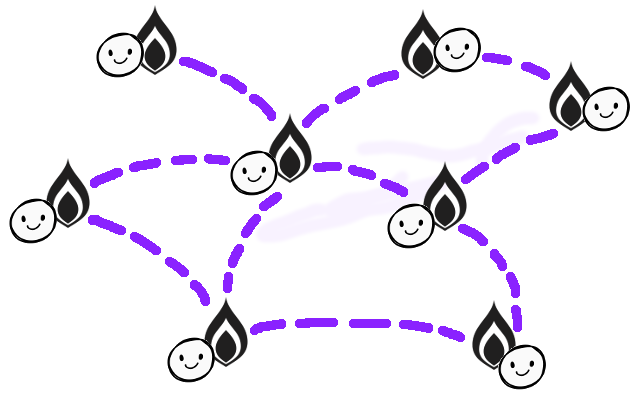
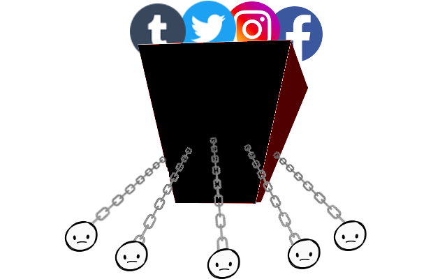
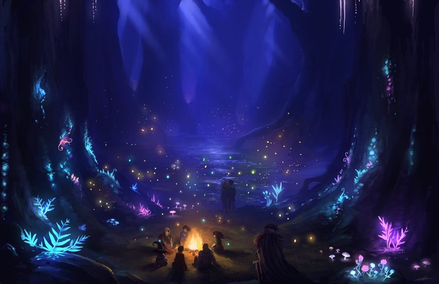

# secret campfire 

`secret campfire` is a free tumblr replacement made by/for tumblr refugees with a few twists:
- Post anything you want
- Your blogs belong 100% to you
- Your blogs live forever and no one can censor, ban or delete you 

## How is *secret campfire* different?

|  |   |
| -------------------------------------------------- | ------------------------------------------------------------ |
| **`secret campfire`** way: your site is 100% yours and you connect to other `secret campfires` directly in your secret network. It takes a few extra minutes to set up, but then you're free to express yourself, your sites live forever and no one can shut you down. | **Old way:** you make an account on *their* site... then they own your account and you become a slave to their site. If your tumblr was murdered by their recent NSFW ban like us, you know this pain. The old way might be easier to set up, but when you use someone else's site you're forever in danger of getting censored, banned & deleted. |

## How to get an official *secret campfire* 

For an official `secret campfire` on `secretcampfire.com`, email [getscampy@secretcampfire.com](mailto:getscampy@secretcampfire.com). We'll set up your new home and give you free lifetime hosting for a one-time fee of $5. Hurry before your favorite name gets taken by someone else.

## How to set up your own free *secret campfire* 

If you are the DIY type, you can follow the steps below to set up your free `secret campfire` by yourself:

1. Click 

2. Make a new Heroku account if you don't have one yet (it's free). Sign in.

3. Enter a name for your app. This name will become your address. E.g., if you enter `scampy` your address will be `scampy.herokuapp.com`. Click `Deploy app`. Wait for it to finish. When it's done, you'll see `Your app was successfully deployed` at the bottom.

4. Click on your account button at the top right of the page and go to `Account settings`. 

5. Click the `Billing` tab and click `Add credit card` to add a credit card. This boosts your account's free quota to 1000 hours a month and lets you one-click install your database in the next steps. Don't worry, your card will not be charged ([more info here](docs/FAQ.md#why-do-i-need-to-provide-my-credit-card-to-heroku-if-its-100-free)).

6. Go back to <a href="https://dashboard.heroku.com" target="_blank">dashboard.heroku.com</a> and select your app.

7. Click the `Resources` tab at the top.

8. In the `Add-ons` search bar, type `mlab` and select `mLab MongoDB`. This database stores your content. Select the `Sandbox - Free` plan and click `Provision`.

9. Visit `your-app.herokuapp.com` in a browser (where `your-app` is the name you entered in Step 3). 

10. You'll see a welcome message that says "Congratulations! Your secret campfire is alive!" Follow the instructions there to set your password and secure your site. 
  
## 

## Prologue

Once upon a time, most websites on the Internet were owned by the people. Humble individuals. Mom, pop, brother and sister. You and me. But that time is long gone. Today, most websites and publishing platforms lie in the fat claws of a few big corporations. 

When someone else controls your data, they have power over you. They can hold you hostage, control what you say and strangle your voice anytime what you say does not agree with their business agenda. And so today, more than ever, our freedom is in danger.

That's why `secret campfire` was created on January 2019 to replace tumblr. Because as you've already noticed, there just aren't any good options out there. And we're tired of rolling the dice and investing in yet another *flavor-of-the-month* platform... only to have them betray us or crap out later.  

With `secret campfire`, you can finally set up your forever home online. It belongs to you and you alone. No one can tell you what you can or can't do with it. And no one can shut you down. 

Enjoy the 'fire and share the love: http://secretcampfire.com

## Features

`secret campfire` is an immortal personal microblogging system that...
- supports tumblr features like `reblog`, `follow`, `queued posting` and an infinite-scroll `dashboard` feed
- can run in the cloud using 100% free (but industry-grade) components, so:
  - it costs you nothing to run your site 24/7 forever 
  - you don't even need a computer to set it up or run it
- can never be killed, because you own and control:
  - your site
  - your content 
  - your social network
- is open-source, so you may customize it to your heart's content
- can run on any platform you like, so you are never locked into one service
- is *free* as in *free*dom

### Frequently asked questions

See [FAQ](docs/FAQ.md)

### How to upgrade your `secret campfire` + stay synced to the latest official version

See [UPGRADING](docs/UPGRADING.md)

### Secret goodies + hidden features

See [ADVANCED](docs/ADVANCED.md)
