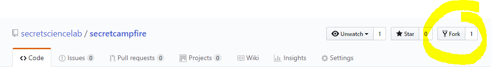
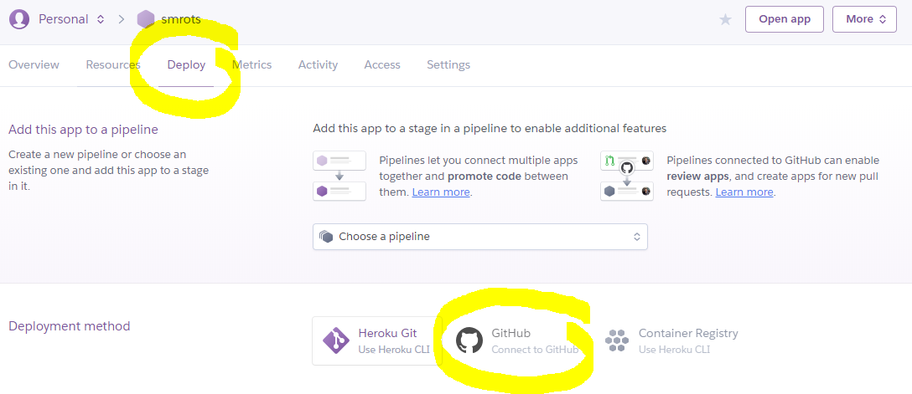
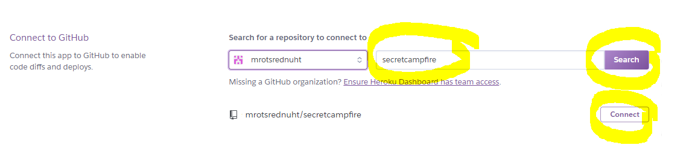
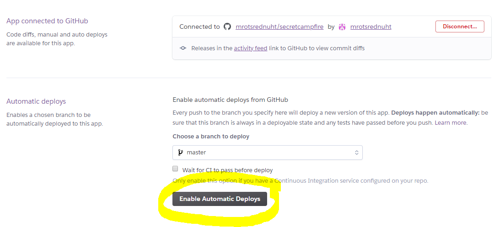
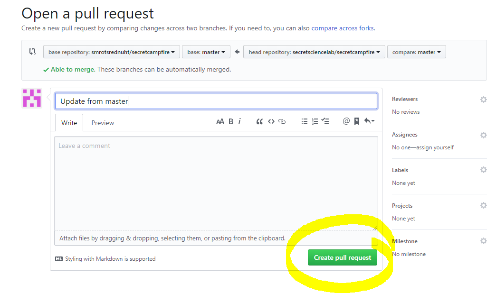
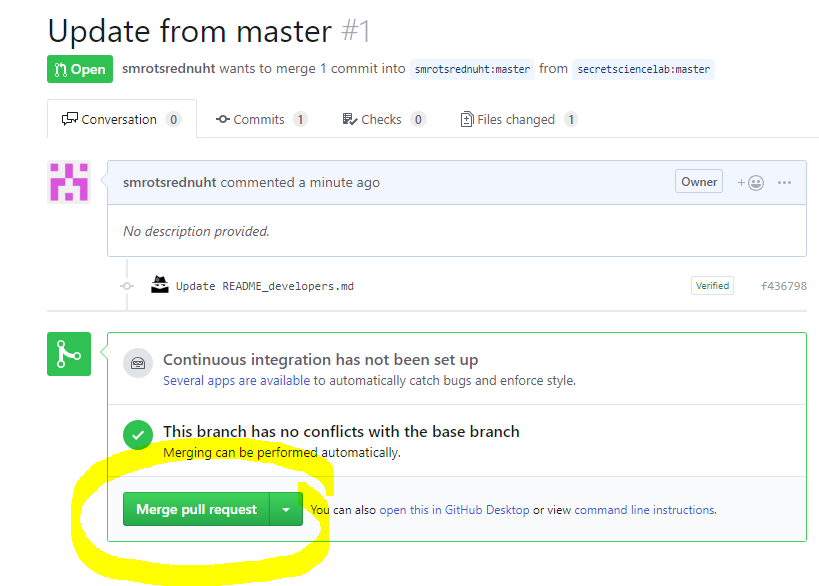

## One-time setup

1. Go to the official `secret campfire` code repository https://github.com/secretsciencelab/secretcampfire and click `Fork`. This pulls a snapshot of the official code into your personal GitHub account.

  

2. Go to https://dashboard.heroku.com and select your blog/app. Click on the `Deploy` tab. Find the `Deployment method` section and click ` GitHub`.

  

3. Find the `Connect to GitHub` section. Search for the `secretcampfire` repository in your GitHub account. (This was created in Step 1. above). Click `Connect`.

  

4. Find the `Automatic deploys` section. Click `Enable Automatic Deploys`. Now whenever your personal `secretcampfire` repository is updated, the new code will automatically get pushed to your blog and installed.

  

---

## Syncing your blog to the latest official code

(Note: Upgrading does not touch any data you have stored your database. Your data is kept safe and unmolested.)

1. Whenever you want to upgrade, login to https://github.com and go to your fork of `secretcampfire`. The URL should look like `https://github.com/<yourname>/secretcampfire`.

2. In your browser's address bar, add `/compare/master...secretsciencelab:master` to the end of the URL. The URL should now look like `https://github.com/<yourname>/secretcampfire/compare/master...secretsciencelab:master`.

3. Verify the changes you are about to sync from the official master repository. Click `Create pull request`.

  

4. Enter some notes for your own reference if you like. Or just type something generic like `Sync`. Click `Create pull request`

  

5. Scroll down and wait for the green button to pop up. Click `Merge pull request`. Click `Confirm merge` to finish.

  

6. That's it! Because you set up `Automatically deploys` in this respository earlier, it will do just that. Now sit back and relax. In a few minutes, your blog will be automatically upgraded to the latest code. Enjoy!
